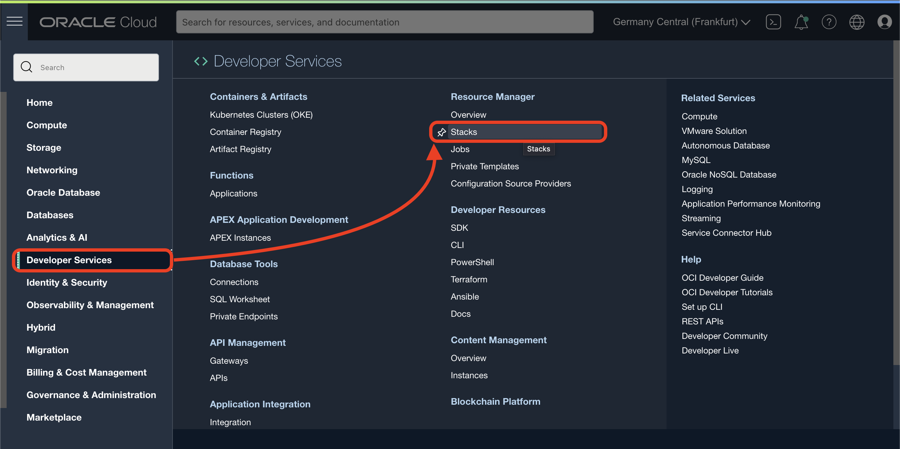
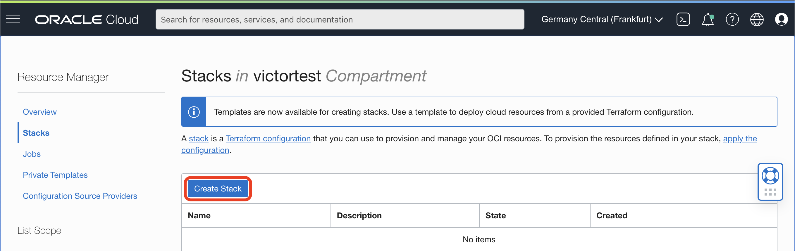
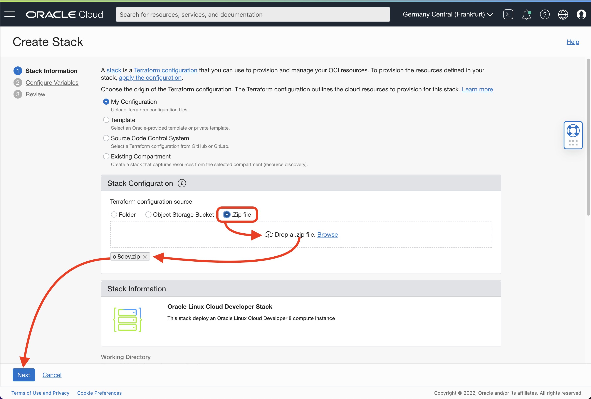
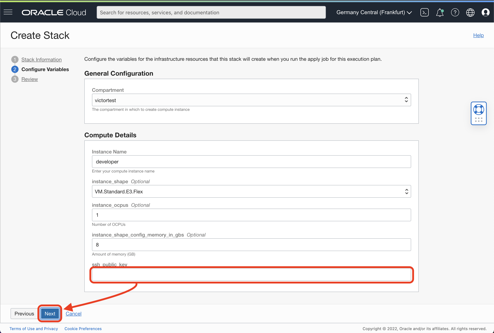
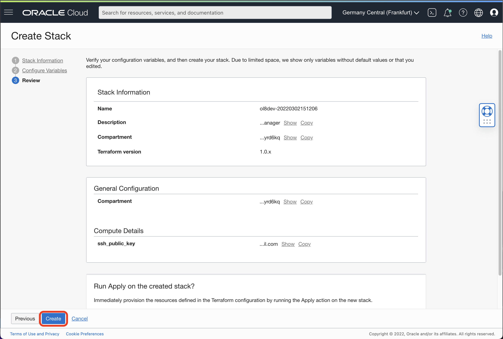
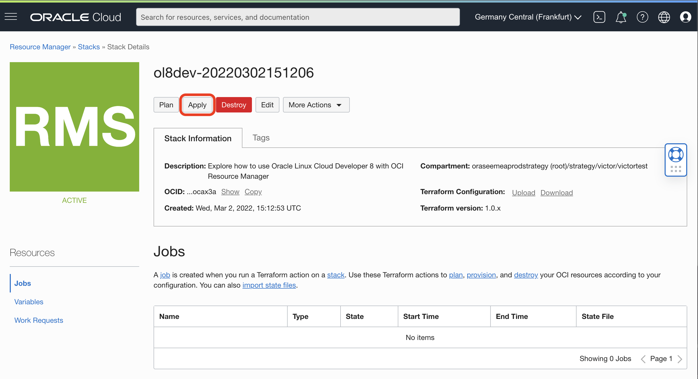
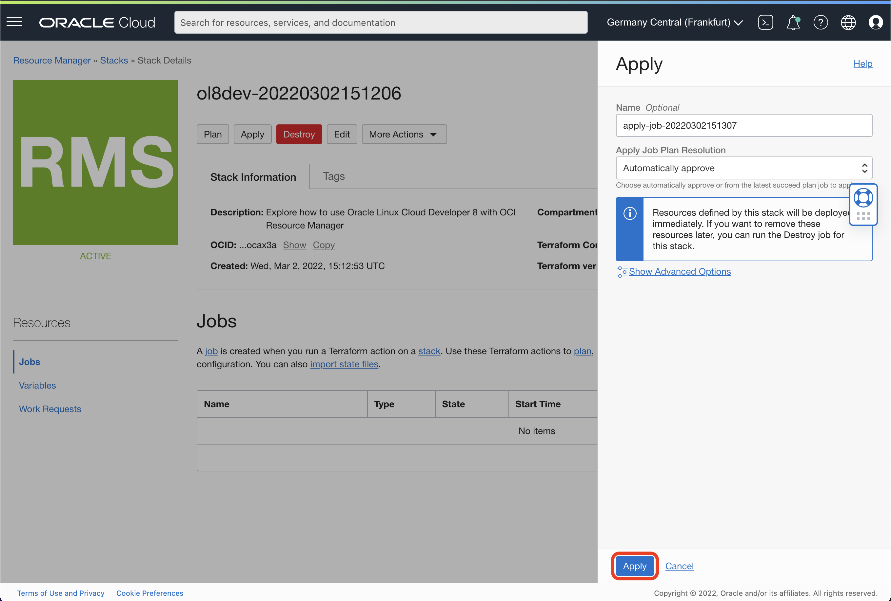
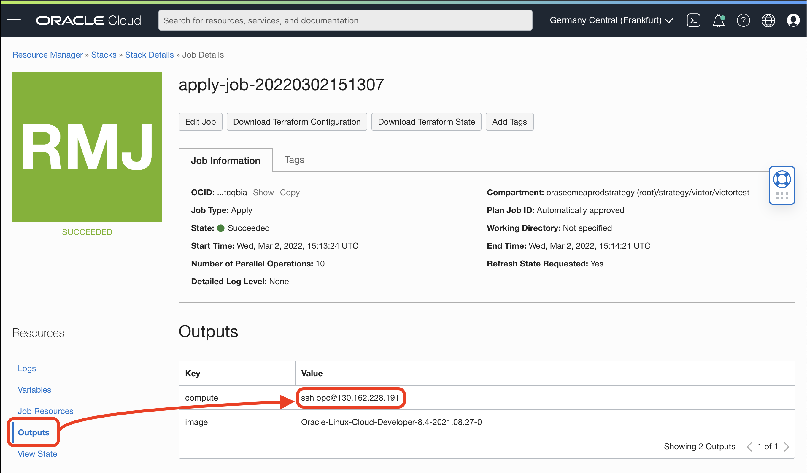

# Oracle Linux Cloud Developer 8 Stack

Deploy an Oracle Linux 8 with all the Cloud Developer tools with this terraform stack with OCI Resource Manager.

[]
(https://cloud.oracle.com/resourcemanager/stacks/create?zipUrl=https://github.com/vmleon/oci-orm-oracle-linux-cloud-developer/releases/download/v0.1.0/ol8dev.zip)

Run the script to generate the ZIP file:
```bash
./genzip.sh
```

You will have a `ol8dev.zip` file in the root folder.

In the OCI Console, go to Menu > Developer Services > Resource Manager > Stacks



And click Create Stack.



Select `.Zip file` and drag and drop the `ol8dev.zip` file. Confirm it has loaded and click **Next**.



Paste your Public SSH, so you can SSH into your new compute instance later. Click **Next**.



Click **Create** to confirm.



Click **Apply** to open the side popup.



Click **Apply** to run the Stack.



The tile on the left will turn yellow/orange when the stack is being deployed. After few minutes, the tile will turn green and you can inspect the output where you have the SSH command with the public IP.


